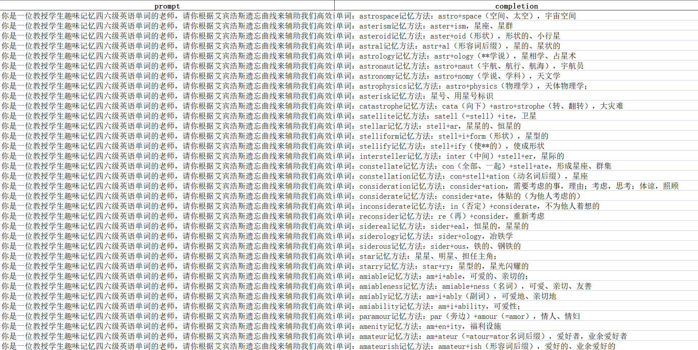
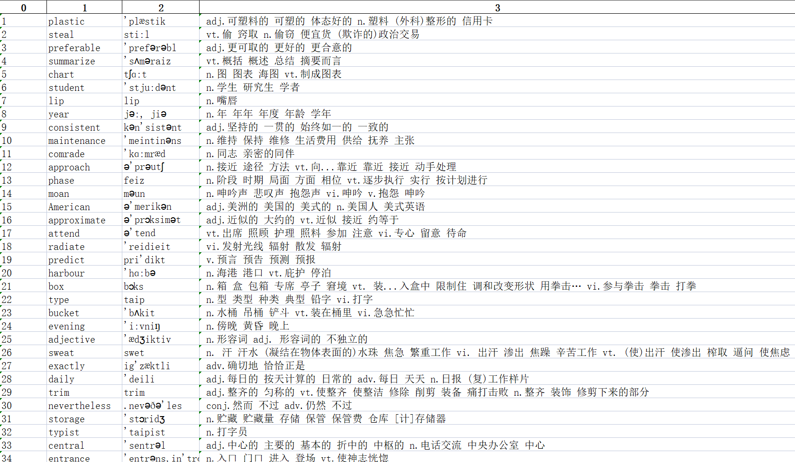
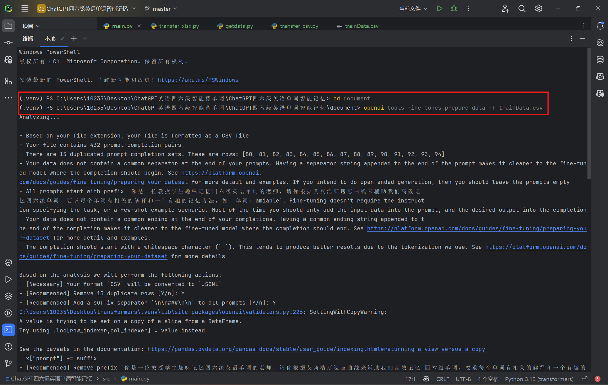
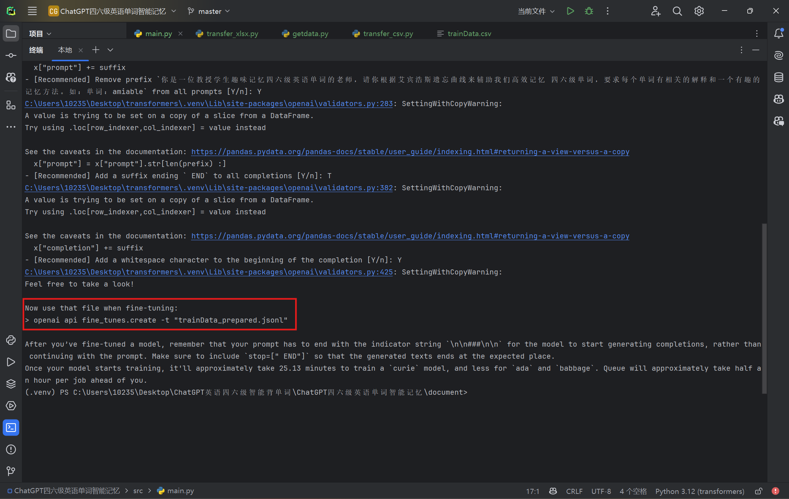
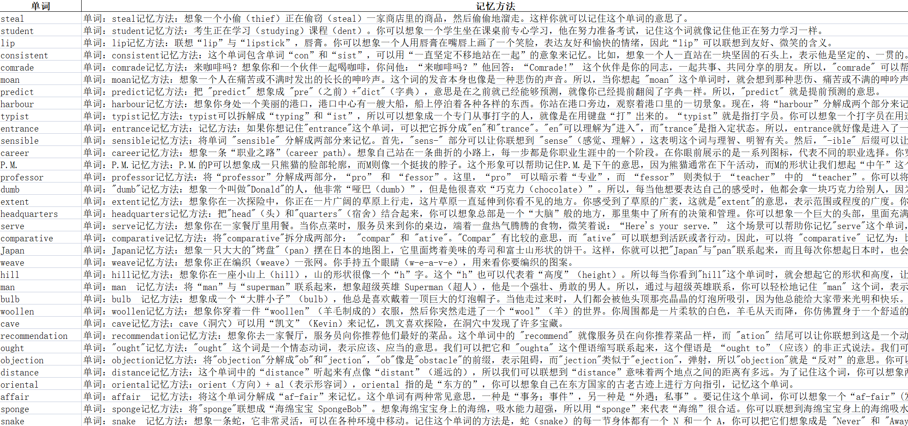

# 基于ChatGPT的英语四六级单词高效记忆

> ***课程***：人工智能基础
>
> ***Author***：叶晓良

---

---

## 一、需求分析

教育是社会发展的基础，而英语作为一门重要的国际交流语言，在各种考试中占据着重要的地位。四六级考试是中国大学生的重要考试之一，而**词汇量**是考试的重要一部分。然而，**传统的背单词方法效率低下**，学生往往难以坚持，导致词汇量难以提升。

大学生在背单词过程中常常面临以下**困扰**：

1. **时间不够**：大学生课业繁重，社团活动等占据了大部分时间，难以抽出足够的时间来背单词。
2. **难以坚持**：传统的背单词方法枯燥乏味，学生难以长期保持学习的积极性，容易放弃。
3. **效果不明显**：传统的背单词方法不够科学，导致学生掌握的单词量增长缓慢，考试成绩提升有限。
4. **遗忘严重**：学习的单词往往很快被遗忘，需要反复复习，但复习方法和时机却很难把握。

以上问题使得大学生在英语词汇学习上处于被动状态，难以取得较好的学习效果。因此，**一个高效、科学、趣味性的英语单词记忆系统**对于解决这些困扰具有重要意义。

针对上述问题，考虑以下**解决方式**：

1. **大学生在学习四六级单词过程中面临的问题包括记忆困难、记忆效果不理想、时间不足等。**我们可以看到**艾宾浩斯遗忘曲线**提供了一个科学的记忆规律，但如何更好地应用这一规律来提高记忆效果是大学生们所关注的问题。
2. **大学生在学习过程中希望能够有趣一些的记忆方法，让学习变得更轻松、有趣。**传统的单词背诵方法往往枯燥乏味，让学生失去学习的动力和兴趣。
3. **大学生对技术的运用有一定需求，他们已经习惯了通过手机、电脑等电子设备来学习和获取信息。**因此，利用AI技术对艾宾浩斯遗忘曲线进行智能生成四六级单词的趣味记忆方法，符合大学生的学习习惯和需求。

基于此背景，结合现实社会大学生成绩，找到ChatGPT预训练模型进行**微调**，以更好的基于**艾宾浩斯遗忘曲线**智能生成四六级单词的**趣味记忆方法**，从而让大学生更加高效、科学、趣味性地记忆四六级单词是一个具有实际意义的项目。本项目旨在利用人工智能技术，通过**深度学习模型**，帮助学生高效记忆英语四六级单词，提高他们的考试成绩。通过自主获取数据集，训练更加符合当代学生记忆英语单词模型，搭建智能学习系统，让学生能够在更轻松、更高效、更有趣的环境下进行单词记忆，达到事半功倍的效果。

**项目的目标是帮助学生提升英语词汇量，提高四六级考试成绩，同时也是对人工智能在教育领域的应用探索，为未来教育的智能化发展提供参考和借鉴。**

---

## 二、项目简介

**人工智能+教育：自主获取数据集，使用人工智能方法，解决教育中的问题。**

本次主题是针对即将来临的四六级英语考试，而自主开发的一款**面向学生进行科学趣味背单词的项目**。作为对`AIGC`方向的探索，基于`LLM`的能力，我对其进行进一步封装，利用`OpenAi`接口能力，投入已事先爬取清洗的数据集进行`fine-tune`，调用`ChatGPT`中我们训练而得的模型，让它能够基于艾宾浩斯遗忘曲线来辅助我们高效记忆四六级单词，生成趣味并且高质量的单词记忆方法，从而从容面对英语单词难以记忆的问题。

- **设计目标与意义**

  我们项目着眼于解决大学生在学习英语四六级单词过程中的困扰，尤其是**时间紧张、难以坚持、效果不明显以及遗忘严重**等问题。通过利用人工智能技术，深度学习模型，结合艾宾浩斯遗忘曲线，**设计出一种科学、趣味性的记忆方法**，能够帮助学生更高效地掌握英语单词，提高他们的考试成绩。

  项目利用了现代技术手段，结合了人工智能、自然语言处理和教育学理论，**将理论知识与实际需求相结合**，为教育领域的智能化发展提供了一个有益的尝试和探索。通过自主获取数据集、使用人工智能方法，以及利用ChatGPT等技术，将传统的英语单词记忆方法与现代科技相结合，为教育教学提供了新的思路和可能性。

  此项目不仅仅是为了提高学生的考试成绩，更是为了提升他们的学习兴趣和学习效果。通过设计趣味性的记忆方法，让学习变得更加轻松、有趣，可以激发学生的学习动力，使他们更愿意投入到英语单词记忆的学习中去。这对于培养学生的**自主学习能力和终身学习意识**具有重要的意义。

- **关键技术**

  1. **ChatGPT微调技术**：利用ChatGPT预训练模型进行`fine-tune`，使其具备更好地基于艾宾浩斯遗忘曲线生成四六级单词的能力。微调是指在预训练模型的基础上，通过进一步的训练，使其**适应特定任务或领域的需求**。这样可以让模型更好地理解和生成与四六级单词相关的内容，生成符合实际落地要求的趣味记忆方法，从而提高记忆效果和趣味性。
  2. **Python爬虫技术**：为了训练模型和设计记忆方法，项目自主获取了与四六级单词相关的数据集。使用Python爬虫技术爬取需要的四六级英语单词表、社会流行的英语单词记忆方法... ...使用爬虫技术可高效爬取所需数据，**覆盖面更广，速度更快**。这些数据集经过清洗和处理，确保了数据的质量和适用性，为模型训练和记忆方法的设计提供了基础。
  3. **Prompt工程技术**：使用prompt工程技术来引导ChatGPT模型生成与四六级单词记忆方法相关的内容，以提高生成结果的准确性和有效性。通过设计合适的prompt，指导模型在生成记忆方法时更加专注于**关键的信息和任务要求**，从而提高项目的整体效果。设计不同类型的prompt来引导模型生成具体的记忆技巧、学习建议或者记忆计划，以帮助学生更好地理解和应用艾宾浩斯遗忘曲线原理。

- **作品特色**

  项目利用ChatGPT等技术生成趣味的记忆方法，根据学生的情绪需求，设计出符合其特点的**记忆策略**。这种趣味记忆方法能够更好地满足学生的学习需求，提高记忆效果和学习兴趣。项目充分利用了现代科技手段，结合了人工智能、自然语言处理和教育学理论，为英语单词记忆提供了新的解决方案。通过将科技与教育相结合，激发学生的学习兴趣，提高他们的学习动力，从而更好地达到记忆的目的，项目为教育领域的智能化发展提供了有益的**探索和尝试**。

---

## 三、作品运行环境

1. **Python解释器版本**：本项目采用的Python版本为Python 3.12。
2. **虚拟环境管理器**：本项目采用virtualenv来进行管理项目所需的依赖包。
3. **依赖包管理**：本项目采用的Python包管理器为pip（pip就足够了）。
4. **集成开发环境（IDE）**：本项目采用的IDE为JetBrains旗下的PyCharm。
5. **软件包引入**：本项目关键的软件包有openai、pandas、xlwt、Document... ...

---

## 四、实验步骤

### 1. 数据收集

使用Python爬虫来爬取项目所需要的数据集。`getdata.py`从互联网上获取现今流行的英语单词趣味记忆方法，将其分为单词和对于的趣味记忆方法记录下来。而根据ChatGPT的`fine-tune`要求，我们将爬取记录的数据，单词部分根据`prompt工程技术`寻找合适的prompt进行拼接形成训练所需的prompt，趣味记忆进行相应处理形成训练所需的completion，分别作为prompt列和completion列保存为`trainData.xlsx`储存下来。

直接下载现有的数据集。下载网络上现有的英语四六级单词表，储存为`wordList.docx`。

爬取的数据初步处理如下：

``````python
data[0] = ("你是一位教授学生趣味记忆四六级英语单词的老师，请你根据艾宾浩斯遗忘曲线来辅助我们高效记忆四六级单词，要求每个单词有相关的解释和一个有趣的记忆方法。"
           "如：单词：amiable\n记忆方法：am+i+able，可爱的、亲切的；\n接下来请你来趣味教授单词：" + data[0])
data[1] = ("单词：" + data[0] + "\n记忆方法：" + data[1])
``````

`getdata.py`如下：

``````python
import re
import urllib.error
import urllib.request
import pandas as pd

import xlwt
from bs4 import BeautifulSoup

# 爬取的数据格式
findspan = re.compile(r'<span.*?>(.*)</span>', re.S)
findp = re.compile(r'<p data-pid=".*?"><b>(.*?)</b>：(.*?)</p>', re.S)

# 爬取的数据来源
url1 = "https://zhuanlan.zhihu.com/p/691112354#/"
url2 = "https://zhuanlan.zhihu.com/p/690535518#/"
url3 = "https://zhuanlan.zhihu.com/p/695945343#/"
url4 = "https://zhuanlan.zhihu.com/p/695929751#/"
url5 = "https://zhuanlan.zhihu.com/p/695907792#/"
url6 = "https://zhuanlan.zhihu.com/p/695890992#/"
url7 = "https://zhuanlan.zhihu.com/p/695833449#/"
url8 = "https://zhuanlan.zhihu.com/p/695782989#/"
url9 = "https://zhuanlan.zhihu.com/p/695672827#/"
url10 = "https://zhuanlan.zhihu.com/p/695628074#/"
url11 = "https://zhuanlan.zhihu.com/p/695494963#/"
url12 = "https://zhuanlan.zhihu.com/p/695473617#/"
url13 = "https://zhuanlan.zhihu.com/p/695457412#/"
url14 = "https://zhuanlan.zhihu.com/p/695408974#/"
url15 = "https://zhuanlan.zhihu.com/p/695397140#/"
url16 = "https://zhuanlan.zhihu.com/p/695238259#/"
url17 = "https://zhuanlan.zhihu.com/p/695213896#/"
url18 = "https://zhuanlan.zhihu.com/p/695056752#/"
url19 = "https://zhuanlan.zhihu.com/p/695030306#/"
url20 = "https://zhuanlan.zhihu.com/p/695014222#/"

# 请求指定URL并返回HTML内容
def askURL(url):
    # 模拟浏览器头部信息
    head = {
        'User-Agent': 'Mozilla/5.0 (Windows NT 10.0; Win64; x64) AppleWebKit/537.36 (KHTML, like Gecko) Chrome/124.0.0.0 Safari/537.36 Edg/124.0.0.0'
    }
    # 请求
    request = urllib.request.Request(url, headers=head)
    html = ""
    try:
        # 使用urllib.request.urlopen发送请求并获取响应
        response = urllib.request.urlopen(request)
        # 读取响应内容并解码
        html = response.read().decode("utf-8")
        # print(html)
    except urllib.error.URLError as e:
        if hasattr(e, "code"):
            print(e.code)
        if hasattr(e, "reason"):
            print(e.reason)

    return html


# 爬取网页
def getDate(url):
    datalist = []
    html = askURL(url)
    # 解析数据
    soup = BeautifulSoup(html, "html.parser")
    for item in soup.find_all('p'):
        item = str(item)
        inq = re.findall(findp, item)
        if len(inq) == 0 or len(inq[0]) != 2:
            continue
        data = [inq[0][0], inq[0][1]]
        print(data)
        datalist.append(data)
    print(datalist)
    return datalist

# 保存数据（首次保存）
def saveData(datalist, savepath):
    workbook = xlwt.Workbook(encoding='utf-8')
    worksheet = workbook.add_sheet('train', cell_overwrite_ok=True)
    col = ("prompt", "completion")
    for i in range(0, 2):
        worksheet.write(0, i, col[i])
    for i in range(0, len(datalist)):
        print("第%d条" % (i + 1))
        data = datalist[i]
        data[0] = ("你是一位教授学生趣味记忆四六级英语单词的老师，请你根据艾宾浩斯遗忘曲线来辅助我们高效记忆四六级单词，要求每个单词有相关的解释和一个有趣的记忆方法。"
                   "如：单词：amiable\n记忆方法：am+i+able，可爱的、亲切的；\n接下来请你来趣味教授单词：" + data[0])
        data[1] = ("单词：" + data[0] + "\n记忆方法：" + data[1])
        print(data)
        if len(data) != 2:
            continue
        for j in range(0, 2):
            worksheet.write(i + 1, j, data[j])

    workbook.save(savepath)

# 保存数据（追加保存）
# 这个函数实际上已经可以替代上面的saveData，已包含了上面的功能
def addData(new_datalist, savepath):
    # 读取已有的Excel文件
    try:
        df = pd.read_excel(savepath)
    except FileNotFoundError:
        df = pd.DataFrame(columns=["prompt", "completion"])  # 如果文件不存在，创建一个空的DataFrame

    # 处理新数据
    for i in range(0, len(new_datalist)):
        word = new_datalist[i][0]
        new_datalist[i][0] = ("你是一位教授学生趣味记忆四六级英语单词的老师，请你根据艾宾浩斯遗忘曲线来辅助我们高效记忆四六级单词，要求每个单词有相关的解释和一个有趣的记忆方法。"
                              "如：单词：amiable\n记忆方法：am+i+able，可爱的、亲切的；\n接下来请你来趣味教授单词：" + word)
        new_datalist[i][1] = ("单词：" + word + "\n记忆方法：" + new_datalist[i][1])

    # 将新数据添加到DataFrame中
    new_data = pd.DataFrame(new_datalist, columns=["prompt", "completion"])
    df = df._append(new_data, ignore_index=True)

    # 保存DataFrame到Excel文件
    df.to_excel(savepath, index=False)


def main():
    # 保存路径
    savepath = "../document/trainData.xlsx"

    # 爬取数据
    for i in range(1, 21):
        url = eval("url" + str(i))
        datalist = getDate(url)
        addData(datalist, savepath)


if __name__ == '__main__':
    main()
    print("爬取完毕")
``````

### 2. 数据清洗

我们使用Python爬虫爬取的数据比较凌乱，有一些数据无法进行项目实验，并且更加精确的数据作为训练集可以更有效的进行`fine-ture`。对于`getdata.py`中储存的`trainData.xlsx`，在进入微调之前先进行数据清洗，将无效数据删除，不完全数据补齐，使其结构化，符合微调训练标准。对于`wordList.docx`中的文本，通过`transfer_xlsx.py`将其转化为`wordList.xlsx`方便之后的实验操作。

`wordList.xlsx`如下：

``````python
from docx import Document
import pandas as pd

doc = Document("../document/wordList.docx")

all_data = []
for table in doc.tables:
    data = []
    first_row = True  # 用于跟踪第一行
    for row in table.rows:
        # 跳过第一行
        if first_row:
            first_row = False
            continue
        row_data = []
        for cell in row.cells:
            row_data.append(cell.text)
        data.append(row_data)
    all_data.extend(data)

df = pd.DataFrame(all_data)

# 创建Excel文件
with pd.ExcelWriter('../document/wordList.xlsx') as writer:
    df.to_excel(writer, sheet_name='WordList', index=False)
``````

展示清洗之后的`trainData.xlsx`（部分）：



展示处理之后的`wordList.xlsx`（部分）：



### 3. fine-tune

将处理之后的`trainData.xlsx`作为训练集调用ChatGPT微调接口进行训练，得到我们需要的可以生成符合实际落地需求的英语趣味记忆方法的模型，从而更好的服务于我们的项目。

1. 根据`fine-tune`要求，先将数据转为csv格式，使用`transfer_csv.py`，具体代码如下：

   ``````python
   import pandas as pd
   
   def convert_xlsx_to_csv(input_path, output_path):
       # 读取xlsx文件
       df = pd.read_excel(input_path)
   
       # 写入csv文件
       df.to_csv(output_path, index=False)
   
   # 定义输入和输出文件路径
   input_path = '../document/trainData.xlsx'  # 输入的xlsx文件路径
   output_path = '../document/trainData.csv'  # 输出的csv文件路径
   
   # 调用函数进行文件转换
   convert_xlsx_to_csv(input_path, output_path)
   ``````

2. 用openAI提供的数据处理工具对数据转成json格式的文件，得到对应的json文件`trainData_prepared.jsonl`

   ``````shell
   openai tools fine_tunes.prepare_data -f trainData.csv
   ``````

   

   

3. 使用openAI提供的可以用于微调的模型 (如ada, babbage, curie, davinci... ...) 进行`fine-tune`，我们项目使用`ada`模型进行训练。提交后会返回给我们一个JOB ID，通过JOB ID跟进模型在远程服务器训练情况。最后得到训练好的模型为`ada:ft-personal-2024-05-08-03-23-45`，进行简单测试。

   ``````shell
   # 设置环境变量，指定OPENAI_API_KEY
   
   
   # 发送请求，开始训练
   # openai api fine_tunes.create -t trainData_prepared.jsonl -m ada
   
   $body = @{
       "training_file" = "file-VC3uLg3KbQ1vZZGjDLHpaCCy"
       "model" = "gpt-3.5-turbo"
   } | ConvertTo-Json
   Invoke-WebRequest -Uri "https://api.openai.com/v1/fine_tuning/jobs" -Method Post -Headers $headers -Body $body
   
   # 跟进模型在远程服务器训练情况
   openai api fine_tunes.follow -i ft-sUEVTuTmUyOGOdpvbAOvEaZo
   
   # 测试训练好的模型
   openai api completions.create -m ada:ft-personal-2023-03-27-03-24-09 -p "你是一位教授学生趣味记忆四六级英语单词的老师，请你根据艾宾浩斯遗忘曲线来辅助我们高效记忆四六级单词，要求每个单词有相关的解释和一个有趣的记忆方法。如：单词：amiable\n记忆方法：am+i+able，可爱的、亲切的；\n接下来请你来趣味教授单词：faker"
   ``````
   
   
   
   
   
4. 查看模型是否已经存在

   ``````python
   models = openai.Model.list()
   ``````

### 4. 结果生成

我们已经拥有了训练完毕的符合要求的模型，接下来使用之前收集并且整理的四六级英语单词表，调用`main.py`，对于具体单词调用训练好的模型，生成我们需要的单词对应的趣味高效的记忆方法，将单词与其结果储存进`result.xlsx`。实验完毕，生成的数据可用于学生对应四六级英语单词的趣味高效记忆，满足实验预期。

`main.py`如下：

``````python
import openai
import pandas as pd


# 调用openai的API生成记忆方法
def create(prompt):
    response = openai.ChatCompletion.create(
        model = "ada:ft-personal-2023-03-27-03-24-09",
        messages = [
            {"role": "system", "content": "你是一位教授学生趣味记忆四六级英语单词的老师，请你根据艾宾浩斯遗忘曲线来辅助我们高效记忆四六级单词，要求每个单词有一个有趣的记忆方法。"
                                          "如：单词：amiable\n记忆方法：am+i+able，可爱的、亲切的；"},
            {"role": "user", "content": prompt}
        ]
    )
    return response.choices[0].message.content

# 读取单词列表
df = pd.read_excel('../document/wordList.xlsx')

results = []
count = 0

# 遍历 df 中的每一行，提取单词，构建提示prompt，调用create函数获取有趣的记忆方法answer
for index, row in df.iterrows():
    if count <= 160:
        count += 1
        continue
    if count == 200:
        break
    word = row[1]
    prompt = (f"你是一位教授学生趣味记忆四六级英语单词的老师，请你根据艾宾浩斯遗忘曲线来辅助我们高效记忆四六级单词，要求每个单词有一个有趣的记忆方法。"
              f"如：单词：amiable\n记忆方法：am+i+able，可爱的、亲切的；\n接下来请你来趣味教授单词：{word}")
    answer = create(prompt)
    results.append({'单词': word, '记忆方法': answer})
    count += 1

# 将结果存储到result.xlsx
try:
    df = pd.read_excel("../document/result.xlsx")
except FileNotFoundError:
    # 如果文件不存在，创建一个空的DataFrame
    df = pd.DataFrame(columns=["单词", "记忆方法"])
result_df = pd.DataFrame(results)
result_df = df._append(result_df, ignore_index=True)
result_df.to_excel('../document/result.xlsx', index=False)
``````

展示最终的`reslut.xlsx`（部分）：


